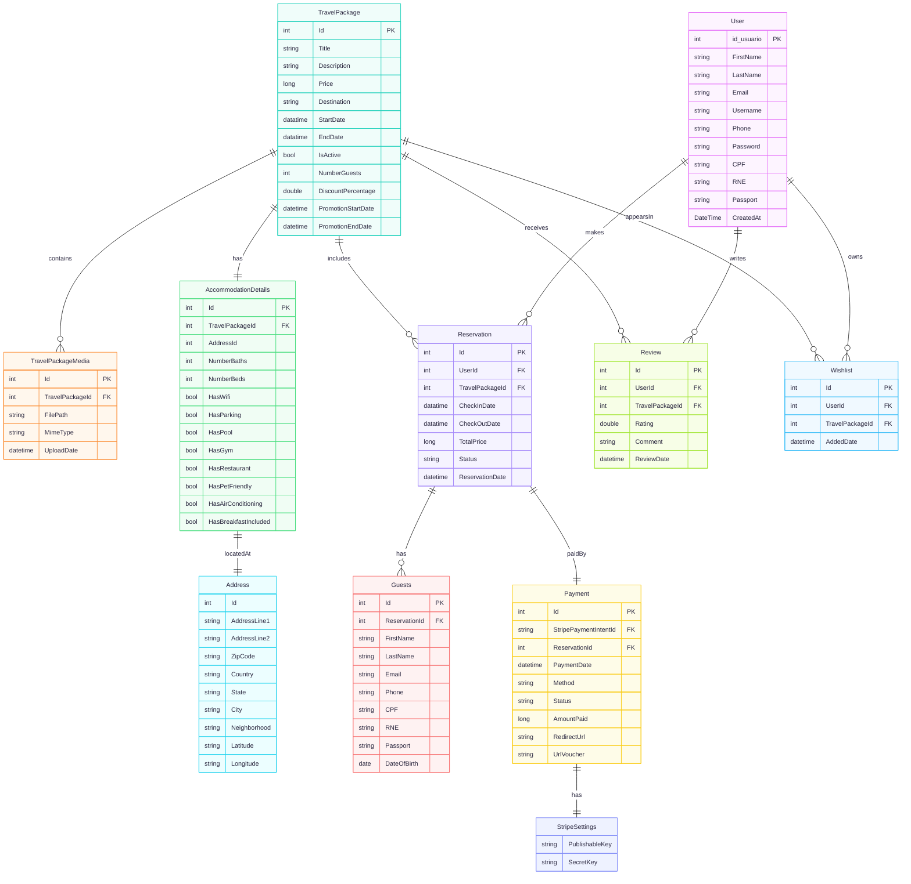
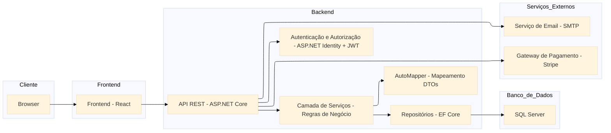

# GoDecola API

**GoDecola API** é uma aplicação RESTful desenvolvida como parte do projeto final da formação FullStack Avanade DecolaTech VI. A plataforma simula um sistema de agência de viagens, incluindo cadastro de usuários, reservas de pacotes, avaliações, wishlist, e administração dos dados.


## Sumário

- [Diagrama Entidade-Relacionamento (ER)](#diagrama-entidade-relacionamento-er)
- [Arquitetura do Sistema](#arquitetura-do-sistema)
- [Tecnologias Utilizadas](#tecnologias-utilizadas)
- [Instruções de Uso](#instruções-de-uso)
- [Contribuidores](#contribuidores)
- [Licença](#licença)


## Diagrama Entidade Relacionamento ER



> Diagrama de classes do projeto GoDecola API

## Arquitetura do Sistema



## Tecnologias Utilizadas

- C# (.NET 9)
- ASP.NET Core Web API
- SQL Server
- Integração de pagamento Stripe
- Git para versionamento
- Swagger

## Instruções de uso

#### Clonar o repositório
``` bash
git clone https://github.com/GoDecola/GoDecola-API.git 
```
#### Acessar o diretório
``` bash
cd GoDecola-API
```
#### Executar o projeto
```bash
dotnet run
```
> 💡 Configure as chaves no **appsettings.json** para conexão com o banco de dados e API de pagamento.

## Licença
Este projeto está licenciado sob a [Licença MIT](LICENSE).
